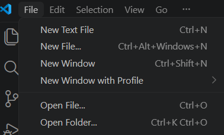
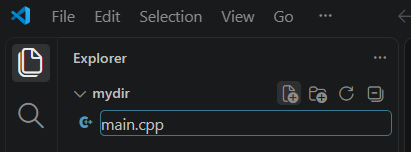
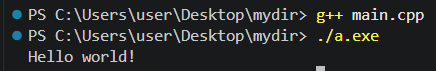

# Насоки за инсталиране на среда и създаване на програми

## Среда за разработка (Visual Studio Code и Visual Studio)

Visual Studio Code:

Основни стъпки:
- инсталиране на текстовия редактор Visual Studio Code
- инсталиране на extension за работа със c++
- инсталиране на компилатор, пакети и добавяне на bin в PATH (Вижте "Example: Install MinGW-x64 on Windows" в линка долу)

Линк към titorial за настройване на средата: https://code.visualstudio.com/docs/languages/cpp

## Компилиране и пускане на програма

1. Създаване и отваряне на папка в VS Code
- създайте празна папка някъде във файловата система
- отворете папката във VS Code чрез File/Open Folder... 

- създайте файл с разширение cpp

2. Компилиране на програмата и стартиране на изпълнимия файл

**Бележка:** по подразбиране изпълнимият файл се казва a.exe. Името му може да се промени чрез:

g++ main.cpp -o new_name.exe